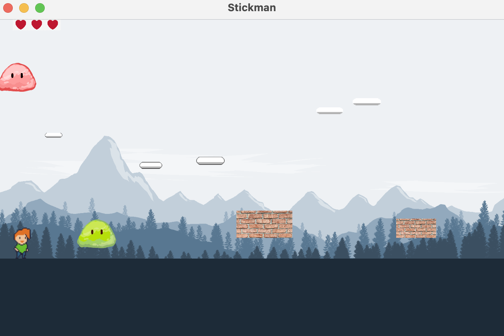

# stickman-basic
This project designs and implements an application model for a platformer video game. The video game consists of a character on the screen, can move left, right and has the ability to jump. The character can also interact with the world, having a floor to stand on, obstacles to interact with (bounce, hit, ..) and maintain a score.  
The application is configurable by a JSON text file, allowing configuration of the
main character's size, background cloud velocity. You will be given an example JSON file format that you must
follow.  
You can see a screenshot of the game here:

## Implementation Details
This app uses the java programming language.
- Level configuration file is in a JSON file.
- Background objects (clouds) must move at a constant speed, your character must be able to move around the stage.
- The character can be created in four sizes which is defined within your configuration file. The size of the stickman as a string. The options are: tiny, normal, large, and giant.
- Stickman’s starting position as an x coordinate

## How to run the app?
This app has been built in Java using Gradle conventions, so make sure you have JDK (Java Development Kit), version 8 or higher, and Gradle distribution installed on your machine (https://gradle.org/install/).  
Next, go to the project's home directory and run `./gradlew run` in the terminal.  

## Design patterns used
- State
    - Since a character has different sizes, I each size has been implemented as a
    state in the code (TinyCharacter, SmallCharacter, LargeCharacter,
    GiantCharacter) implementing the common interface CharacterSize. They are
    responsible for returning the height and width of each type to be used by
    CharacterImpl. This makes eliminates the need for conditional statements in
    CharacterImpl,which makes further development of the code easier. (Align
    with SOLID’s open/closed principle)
    - The character’s situation in the program is implemented with the state
    design pattern (CharacterState interface)Character can either continue the
    game as usual (CharacterContinue), wins the game (CharacterWon), loses the
    level (CharacterLost), or hit an enemy and must restart the level
    (CharacterReconfigure). Every state has its own update screen method that
    would update the screen as intended, and change method that would change
    the state of the game according to the events happening in the game.
- Factory method
    - Since there are different sizes for the character, I created a CharacterFactory
    class that would create the correct CharacterSize (state) according to the
    input from the json file. This would be then returned to the CharacterImpl
    class to be used.
    - Used to create different types of enemies in EnemyFactory according to the
    input from json file and then return it to LevelImpl.
    - Used to create platforms in PlatformFactory and return it to LevelImpl. Although there is only one platform type in this stage (NormalPlatform), as I am planning to add more platforms, I have implemented this design to easily expand my code in the next stage with new platforms.
    - As previously explained, EntityView has two implementations, EntityViewFixed and Dynamic. Hence ,EntityViewFactory has been implemented to create the correct entity view according to the “type” of the entity being passed to it and return it to GameWindow for drawing. Benfits: Uisng the state design pattern and Factory method, the need for conditional statements in eliminated from main classes such as CharacterImpl, which makes the design more flexible and more open to extensions (SOLID open/close principle).
- Strategy
    - Since every enemy’s collision with the character has a different effect, I have implemented the general EntityCollision interface that all entities implement.  There will be different collision strategy implementations by the classes that use this interface. (eg, NormalPlatformCollisionStrategy, MovingEnemyCollisionStrategy, etc.). Whenever an entity is initialised that interacts with the character (eg, Enemy), its relevant collisionStrategy will also be initialised and called.
    - The same pattern used for Enemy movements. Benefits: Makes the code reusable for further expansions (eg, changing the movement of an enemy, adding a new movement)
- Observer: Since a character’s state (CharacterWon, CharacterReconfigure, etc)
gets updated according to the events in LevelImpl, I have made character an
object and LevelImpl the subject it watches (Character implements the interface
Observer and LevelImpl implements Subject). Every time that an important event
occurs in the game (eg character loses a life, or he wins the game), LevelImpl will
post the relevant message, CharacterImpl receives this update and changes the
state of the character.
    - Benefits: : it increases loose coupling between different objects, which is aligned with GRASP. It also gives us a chance to add more observers if we need to do so in the future expansions (eg, playing a multiple game with two characters).
